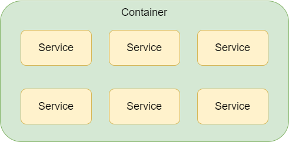

# ASP.NET Core中的依赖注入

ASP.NET Core 支持依赖注入软件设计模式，这是一种在类及其依赖关系之间实现控制反转的技术。

**控制反转**（Inversion of Control，缩写为**IoC**），是面向对象编程中的一种设计原则，可以用来减低计算机代码之间的耦合度。

**依赖注入**（Dependency Injection，简称**DI**）则是一种实现控制反转的方法。

## 依赖注入和控制反转

理解了依赖注入，就理解了控制反转

### 依赖注入

依赖项是指一个对象所依赖的对象。

```c#
public class IndexController : Controller
{
    private readonly Dependency _dependency = new Dependency();

    public IActionResult Index()
    {
        _dependency.WriteMessage("message");
        return null;
    }
}

public class Dependency
{
    public void WriteMessage(string message)
    {
        Console.WriteLine(message);
    }
}
```

在以上代码中，类`IndexController`的`Main`方法直接实例化了`Dependency`对象，并调用其`WriteMessage`方法。

那么`Dependency`就是`IndexController`的依赖项。这样的直接依赖会产生问题，应避免使用，原因如下：

- 要用不同的实现替换 `Dependency`，必须修改 `IndexController` 类。
- 如果 `Dependency` 具有依赖项，则必须由 `IndexController` 类对其进行配置。 在具有多个依赖于 `Dependency` 的类的大型项目中，配置代码将分散在整个应用中。
- 这种实现很难进行单元测试。 应用需使用模拟 `Dependency` 类，而这种方法很难实现。

依赖注入通过以下方式解决这些问题：

- 使用接口或基类将依赖关系抽象化。
- 在服务容器中注册依赖关系。 ASP.NET Core 提供了一个内置的服务容器 [IServiceProvider](https://docs.microsoft.com/zh-cn/dotnet/api/system.iserviceprovider)。 服务通常已在应用的 `Startup.ConfigureServices` 方法中注册。
- 将服务注入到使用它的类的构造函数中。 服务容器负责创建依赖关系的实例，并在不再需要时将其释放。

把`Dependency`类抽象成接口`IDependency`

```c#
public interface IDependency
{
    void WriteMessage(string message);
}
```

类`Dependency`实现接口`IDependency`

```c#
public class Dependency : IDependency
{
    public void WriteMessage(string message)
    {
        Console.WriteLine(message);
    }
}
```

通过`Startup`类的`ConfigureServices`方法，在服务容器中注册具体类型 为`Dependency`的 `IMyDependency` 服务。`AddScoped`表示使用范围内生命周期注册服务。

```c#
public void ConfigureServices(IServiceCollection services)
{
    services.AddScoped<IDependency, Dependency>();
    services.AddControllersWithViews();
}
```

在`IndexController`中注入`IDependency`服务并调用`WriteMessage`方法

```c#
public class IndexController : Controller
{
    private readonly IDependency _dependency;

    public IndexController(IDependency dependency)
    {
        this._dependency = dependency;
    }

    public IActionResult Index()
    {
        _dependency.WriteMessage("message");
        return null;
    }
}
```

通过使用依赖注入模式，类`IndexController`:

- 不再使用具体类型 `Dependency`，仅使用它实现的 `IDependency` 接口。 这样可以轻松地更改`IDependency`的实现，而无需修改类`IndexController`。
- 不直接创建 `Dependency` 的实例，而是由服务容器创建。

### 控制反转

那么到底什么被反转了？获得依赖对象的过程被反转了。

在以上的例子中，`IndexController`获得`Dependency`对象的过程被反转了。以往是`IndexController`直接实例化`Dependency`对象，现在是由服务容器实例化，并通过`IndexController`的构造函数注入。

## ASP.NET Core中的依赖注入

在前文提到了服务容器、服务生命周期，也演示了简单的服务注册、使用方式。下文将展开说明更详细的内容

### 服务容器

首先，服务一词对应.NET中的对象，通常是以接口、抽象类、IOption（设置）的方式来展现，当然也可以是具体的实现类。

容器就是装载服务的地方。



### 注册服务

注册服务就是把服务装到容器里。通常使用`StartUp`类中的`ConfigreServices`方法：

```c#
public class Startup
{
    // This method gets called by the runtime. Use this method to add services to the container.
    public void ConfigureServices(IServiceCollection services)
    {   
        services.AddSingleton<ISingleton, Singleton>();
        services.AddScoped<IScoped, Scoped>();
        services.AddTransient<ITransient, Transient>();

        services.AddControllersWithViews();
    }
}
```

以上代码使用了三个不同的方法来注册不同生命周期的服务，它们的区别如下：

| 服务类型          | 创建实例                    | 释放实例 | 在什么范围内相同                             |
| :---------------- | --------------------------- | -------- | -------------------------------------------- |
| Singleton（单例） | 第一次使用                  | 关闭程序 | 同一个程序中                                 |
| Scoped（范围）    | Web项目中，每个请求创造一次 | 结束请求 | 同一个请求（准确来说是同一个`ServiceScope`） |
| Transient（瞬时） | 每次从容器中获取时          | 结束请求 | 都不相同                                     |


### 生命周期管理

### 注意事项

### 参考

https://docs.microsoft.com/zh-cn/aspnet/core/fundamentals/dependency-injection?view=aspnetcore-5.0

https://zh.wikipedia.org/wiki/%E6%8E%A7%E5%88%B6%E5%8F%8D%E8%BD%AC