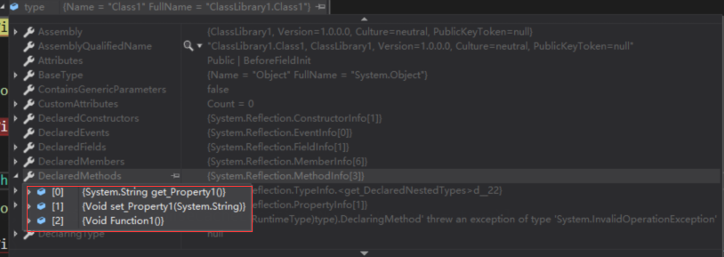

# .NET中反射的应用

反射提供描述程序集、模块和类型的对象（[Type](https://docs.microsoft.com/zh-cn/dotnet/api/system.type) 类型）。 可以使用反射动态地创建类型的实例，将类型绑定到现有对象，或从现有对象中获取类型，然后调用其方法或访问器字段和属性。 如果代码中使用了特性，可以利用反射来访问它们。 

## 简单应用

为了更好地描述反射是如何工作的，我们先看一段平时直接调用方法，给属性赋值的代码

```c#

```

然后通过反射来实现同样的功能

## 反射的应用场景


以上对反射的描述来自[微软官方](https://docs.microsoft.com/zh-cn/dotnet/csharp/programming-guide/concepts/reflection)，我把这描述分成几部分来详细介绍。

- 反射提供Type类型的对象
- 反射创建类型的实例，并绑定到现有对象
- 反射从现有的对象中获取类型，并访问和调用

## 反射提供Type类型对象

[Type](https://docs.microsoft.com/zh-cn/dotnet/api/system.type) 类型，是表示类型声明：类类型、接口类型、数组类型、值类型、枚举类型、类型参数、泛型类型定义，以及开放或封闭构造的泛型类型。

以我们常用的Class为例，Type类型中包含描述Class的信息，比如这个Class拥有哪些属性和方法。

```c#
public class Class1
{
    public string Property1 { get; set; }

    public void Function1()
    {

    }
}
```

我们使用typeof方法获取Class1的定义

```c#
var type=typeof(Class1);
```



可以看到我们定义的Function1、get和set方法都被包含在type变量里。

## 参考

https://docs.microsoft.com/zh-cn/dotnet/csharp/programming-guide/concepts/reflection

